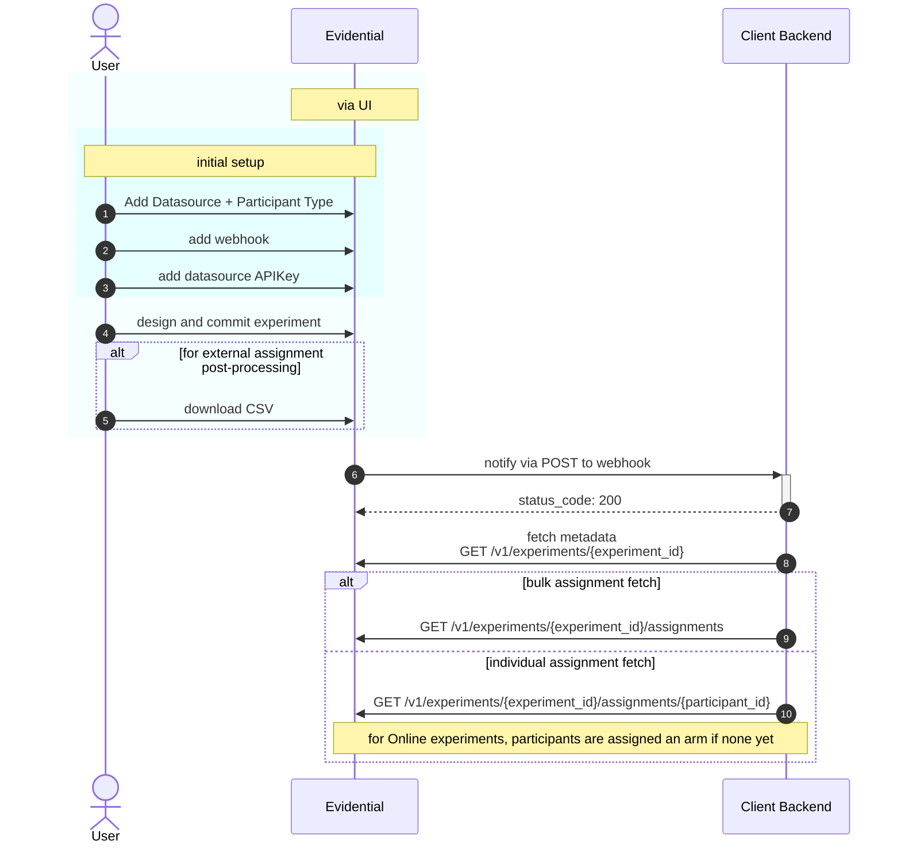

# Client Integrator instructions

Below describes steps typically taken for a client to integrate programmatically with Evidential as
part of automating the execution of experiments in the client's systems. Portion highlighted in
light blue denote human interaction with the Evidential UI.

1. Typically an integrator would handle initial configuration of Datasource (data warehouse) and
   Participant Type (backed by a dwh table) on behalf of the day-to-day users setting up
   experiments.

1. Adding a Webhook (in your Organization settings) is required to receive notifications of
   particular events. Your backend must expose an endpoint to which Evidential can POST data to, and
   should validate the Authorization header contains the provided token to ensure requests are
   legitimate.

1. Adding an API Key (per Datasource; visit its details page) is required to make requests to
   Evidential's backend to fetch experiment and assignment information. All API requests should have
   the custom headers `Datasource-ID:` and the generated `X-API-Key:` attached. These IDs are
   available via copy-to-clipboard buttons in the UI.

1. When a user commits an experiment, internally a corresponding `Event` is written to the app db,
   along with a `Task` to issue a notification to the webhook registered in (2). Users can also see
   the `experiment.created` events in their Organization's settings page > Recent Events. For more
   implementation details, see the [task queues
   docs](https://github.com/agency-fund/xngin/blob/main/docs/TASK-QUEUES.md).

1. (Optional) For Preassigned experiments the user may immediately export a CSV version of the
   participant assignments and any strata for manual uploading to other systems or further
   post-processing or analysis. Other experiment types can also have their assignments exported this
   way as participants are added.

1. [Receiving Notifications] The client's backend system must have an "endpoint" that accepts a JSON
   payload POSTed to the registered webhook. A notification type's body spec is described in the
   webhook's details in the UI.

1. The endpoint should return a HTTP response code indicating success (200-299). Users can look for
   `webhook.sent` in their Recent Events and see success/failure status. If the endpoint does not
   return a 2xx status code, Evidential will retry with an exponential backoff.

1. [Experiment metadata] It is recommended that the client system fetch the newly committed
   experiment's information to facilitate execution on the client's side. It is expected that at a
   minimum, the experiment's start and end date could be used to signal when to enable the
   experiment and later shut it off. Furthermore, for an Online experiment, filters used to target
   eligible participants could be used to determine for whom to issue an assignment request.

1. [Bulk assignment lookup] In addition to CSV exports from the UI, one can also export *all*
   assignments made so far via API as CSV or JSON. This allows a client's backend to know which
   participant ids were (pre)assigned to which arms of an experiment. For example, prior to the
   start date of a Preassigned experiment, one could map the ids to phone numbers used in WhatsApp
   and mark those user profiles with the unique arm id assignments, so that the correct path is
   taken in the experiment's chat flow.

1. [Individual assignment lookup]

- For *Preassigned* experiments, one can look up an individual participant's arm assignment given
  the `experiment_id` and the `participant_id` uniquely identifying it in your system. Requests
  for the same `<experiment_id, participant_id>` will return the same result.
- For *Online* experiments, if the `participant_id` has not been seen yet, Evidential will
  randomly generate and return an arm assignment per the experiment's design. NOTE: For *Online*
  experiments, every request to the endpoint will be assigned an arm, so unless traffic volume is
  very low, it is recommended that you first sample in the client's system the percentage of
  traffic to route into the experiment, and then make the Evidential request for each (vs e.g.
  routing 100% of your users into an Evidential experiment in which 90% are in a Control arm and
  10% in Treatment).
