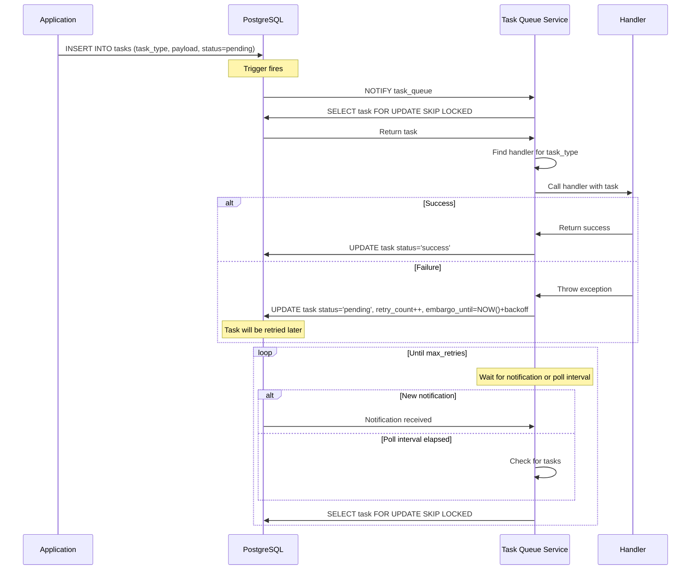
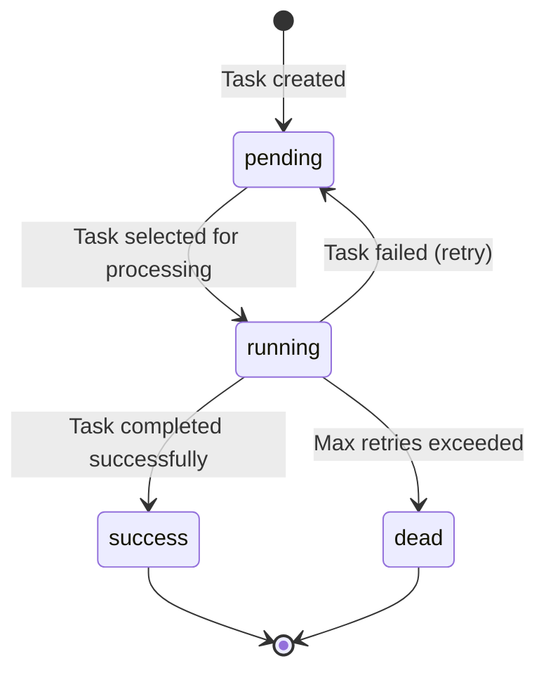

# Task Queue

Evidential supports basic asynchronous queuing functionality.

## Architecture

The task queue is very basic but functional. The system uses PostgreSQL as both the storage mechanism and the
coordination system for distributed task processing. This approach has some strengths:

1. **Shared Database**: Both the main application and the task queue service connect to the same PostgreSQL database,
   eliminating the need for a separate message broker.

1. **Simple Task Enqueuing**: Adding a task to the queue is as simple as inserting a row into the `tasks` table with the
   appropriate task type and payload. The application doesn't need to know about the implementation details of the task
   handlers.

1. **Efficient Notification System**: The task queue leverages PostgreSQL's NOTIFY/LISTEN mechanism to efficiently wait
   for new tasks:

   - When a new task is inserted, a database trigger automatically sends a NOTIFY event
   - The task queue service LISTENs for these notifications, waking up immediately when new tasks arrive
   - This approach combines the responsiveness of event-driven processing with efficient polling

1. **Robust Error Handling**:

   - Failed tasks are automatically retried with an exponential backoff strategy
   - Each retry increments a counter and increases the delay before the next attempt
   - After reaching the maximum retry count (default: 10), tasks are marked as "dead"
   - All errors are logged with detailed information for debugging

1. **Task Isolation**: Each task runs in its own database transaction, ensuring that database operations within a task
   are atomic and don't affect other tasks. Only one task is run at a time, and they are run in order of insertion.

1. **Concurrency Control**: The queue uses PostgreSQL's support for efficient lock skipping (`FOR UPDATE SKIP LOCKED`)
   to ensure that multiple task queue workers can process tasks concurrently without processing the same task twice.

### Task Queue Flow

The following sequence diagram illustrates the flow of a task through the system:



### Task States

Tasks in the queue can exist in one of several states, as illustrated in the following state diagram:



## Running the Task Queue Service

You can start the task queue service locally via:

```shell
task start-tq
```

Deploying it in a production setting is as easy as passing it a DSN via the DATABASE_URL environment variable or
command line flags. See Dockerfile.tq.railway for inspiration.

## Enqueuing a Task

To enqueue a task, insert a row into the Task table. Tasks are identified by their "type". The Task Queue Service
uses the tasks "type" to dispatch it to a handler. The value you store in the `payload` field must be comprehensible
to the handler. Example:

```sql
INSERT INTO tasks (id, task_type, payload)
VALUES ('task_RANDOM',
        'webhook.outbound',
        '{"url": "https://example.com", "method": "POST"}')
```

## Implementing a Handler

Handlers are implemented within the Task Queue service. To deploy a new handler, register it with the TaskQueue service
in [src/xngin/tq/cli.py](../src/xngin/tq/cli.py). Example:

```python
def webhook_handler(task: Task):
    payload = json.loads(task.payload)
    response = httpx.post(payload["method"], payload["url")
    response.raise_for_status()

# register the handler before queue.run().
queue.register_handler("webhook.outbound", webhook_handler)
```
